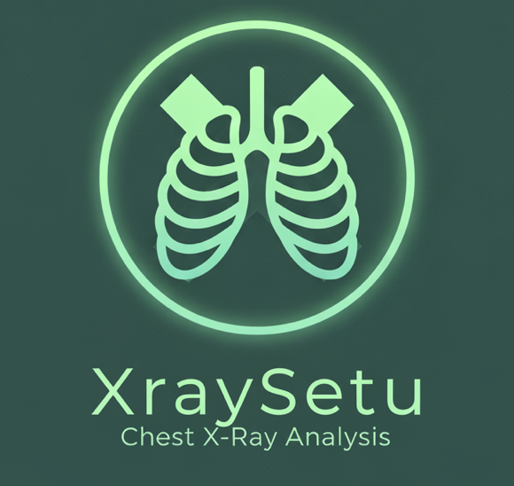

# 🩺 AI-Powered Chest X-Ray Xray Setu


### [Live Demo](https://xray-setu-app.vercel.app) | [Demo Video](https://drive.google.com/file/d/1k1fur3WzxgE3iwJYAswXxWi4q6gj_cGU/view?usp=sharing) | [Kaggle Dataset](https://www.kaggle.com/datasets/paultimothymooney/chest-xray-pneumonia/data)

A Clinical Decision Support System (CDSS) for analyzing chest X-ray images to detect pneumonia and aid COVID-19 diagnosis. Built with a Convolutional Neural Network (CNN) trained on the Kaggle Chest X-ray Pneumonia Dataset (~5,000 images), achieving 89.9% accuracy. Features a full-stack architecture with Next.js, Django, TensorFlow, and PostgreSQL, supporting drag-and-drop uploads, patient vitals input, and detailed diagnostic reports. Includes demo and integrated BE modes for seamless UX. Developed as a course project at Cairo University, rivaling graduation project quality.

This semi-graduation project demonstrates a clean architecture approach with three distinct service layers (Frontend, Backend, and AI Analysis) that work together to provide a comprehensive medical diagnostic tool.



## 📋 Table of Contents
- [Features](#-features)
- [Tech Stack](#-tech-stack)
- [Architecture](#-architecture)
- [Getting Started](#-getting-started)
- [Clinical Workflow](#-clinical-workflow)
- [UI & UX Highlights](#-ui--ux-highlights)
- [Backend API Documentation](#-backend-api-documentation)
- [Deployment](#-deployment)
- [Development Notes](#-development-notes)
- [License](#-license)
- [Contributing](#-contributing)
- [Author](#-author)

## 📸 Features

- **🖼️ X-ray Image Upload**: Drag and drop interface for easy chest X-ray upload
- **🤖 AI-powered Analysis**: Advanced machine learning models for accurate diagnostic suggestions
- **🔍 Heatmap Visualization**: Visual highlighting of regions of interest in X-ray images
- **📊 Detailed Results**: Comprehensive diagnostic suggestions with confidence scores
- **🔁 Rule-Based Fallback**: Intelligent fallback mechanisms when ML inference is uncertain
- **📋 Patient Vitals Integration**: Form for capturing patient temperature, blood pressure, heart rate, and symptoms
- **🏥 Enhanced Diagnosis**: Combined analysis of imaging findings with clinical parameters
- **⚕️ Treatment Recommendations**: Tailored treatment suggestions based on imaging and vitals
- **⚠️ Severity Classification**: Automatic categorization of cases as Low, Moderate, or High severity
- **🌗 Light & Dark Mode**: Toggle between themes for comfortable viewing in any environment
- **📱 Responsive Design**: Optimized user experience across all device sizes
- **🔒 User Authentication**: Secure login and registration system
- **📊 Interactive Data Visualization**: Display of prediction results using Recharts
- **♻️ Component Architecture**: Clean, modular design with reusable components
- **📄 Downloadable Reports**: Generate comprehensive diagnostic reports (coming soon)

## 🧱 Tech Stack

### 🌐 Frontend
- **Next.js 15.3**: React framework with App Router architecture
- **TypeScript**: Type-safe code development
- **React 19**: Component-based UI library
- **Tailwind CSS**: Utility-first CSS framework for styling
- **React Dropzone**: For drag-and-drop file uploads
- **Recharts**: For data visualization
- **Lucide React**: Icon library

### 🧠 AI & Backend
- **Python 3.12**: Core backend language
- **Django 4.2**: Backend web framework
- **Django REST Framework**: API development toolkit
- **PyTorch/TensorFlow**: ML model implementation
- **Pillow/OpenCV**: Image processing libraries
- **NumPy/Pandas**: Data handling
- **SQLite**: Development database (PostgreSQL in production)

### Database Configuration
This application uses SQLite for local development. The database is automatically configured in the Django settings when no `DATABASE_URL` environment variable is provided. For production deployments, you can configure PostgreSQL by setting the `DATABASE_URL` in the backend [.env](file:///Users/ankushsaha/Desktop/cdss-xray-app-main/backend/core/.env) file.

## 🏗 Architecture

The application follows a modern client-server architecture with a clean separation of three distinct service layers:

1. **Frontend Service**: 
   - Built with Next.js 15.3, React 19, TypeScript, and Tailwind CSS
   - Handles user interface, interactions, and data visualization
   - Provides responsive design for various devices and clinical settings
   - Features interactive heatmap visualization of X-ray regions of interest
   - Includes light/dark mode for different working environments
   - Implements comprehensive form validation and error handling
   - Supports downloadable diagnostic reports in PDF format

2. **Backend Service**: 
   - Developed with Django 4.2, Python 3.12, and Django REST Framework
   - Manages API endpoints, authentication (JWT-based), and user management
   - Handles image processing and metadata extraction
   - Provides secure data storage and retrieval
   - Implements clinical data validation and processing
   - Offers comprehensive error handling and logging

3. **AI Analysis Service**: 
   - Integrates deep learning models for chest X-ray pathology detection
   - Analyzes images for conditions like pneumonia, COVID-19, cardiomegaly, etc.
   - Incorporates rule-based systems for diagnostic refinement using patient vitals
   - Generates heatmaps highlighting regions of interest in X-rays
   - Provides severity classification (Low, Moderate, High) based on findings
   - Delivers evidence-based treatment recommendations
   - Supports multiple diagnosis possibilities with confidence scores

Each layer has clear responsibilities and communicates through well-defined interfaces:

```
📁 xraysetu/           # Frontend application
├── app/                    # Next.js App Router pages
│   ├── layout.tsx          # Root layout with providers
│   ├── page.tsx            # Homepage
│   ├── analyze/            # X-ray upload & analysis
│   ├── result/             # Analysis results display with vitals form
│   ├── login/              # Authentication
│   └── register/           # New user registration
├── components/             # Reusable React components
│   ├── ui/                 # UI components
│   │   ├── ImageUploader.tsx
│   │   ├── HeatmapViewer.tsx
│   │   ├── PatientVitalsForm.tsx
│   │   ├── FinalDiagnosisCard.tsx
│   │   └── ...
├── hooks/                  # Custom React hooks
├── utils/                  # Helper functions
│   ├── predictionService.ts
│   └── imageUploadService.ts
├── types/                  # TypeScript type definitions
└── public/                 # Static assets

📁 backend/                 # Backend services
├── core/                   # Django project
│   ├── settings.py         # Project configuration
│   └── urls.py             # URL routing
├── auth_service/           # Authentication API
│   ├── models.py           # User model
│   ├── views.py            # Auth endpoints
│   └── ...
├── imaging_service/        # X-ray processing service
│   ├── models.py           # X-ray and diagnosis models
│   ├── views.py            # Image analysis endpoints
│   └── ...
└── requirements.txt        # Python dependencies
```

## 🚀 Getting Started

### Prerequisites
- Node.js 18.x or higher
- npm or yarn
- Python 3.8+ (for backend services)
- Git

### Quick Start
For easier development, you can use the provided script to start both servers:

```bash
# Make the script executable (if not already)
chmod +x start-dev.sh

# Run both backend and frontend
./start-dev.sh
```

### Manual Setup

#### 1. Clone the Repository

```bash
git clone https://github.com/MMansy19/xray-setu-app.git
cd xraysetu
```

#### 2. Frontend Setup

```bash
# Navigate to frontend directory
cd xraysetu

# Install dependencies
npm install
# or
yarn install

# Run the development server
npm run dev
# or
yarn dev
```

The application will be available at [http://localhost:3000](http://localhost:3000) (or the next available port).

#### 3. Backend Setup

```bash
# Navigate to backend directory
cd backend/core

# Install dependencies
pip install -r requirements.txt

# Run database migrations
python manage.py migrate

# Start the Django development server
python manage.py runserver
```

The backend API will be available at [http://localhost:8000](http://localhost:8000).

### Troubleshooting
If you encounter a "Load failed" error or issues with loading home page items, please refer to our [Troubleshooting Guide](TROUBLESHOOTING.md) for detailed solutions.

### 4. Demo Mode Configuration

The application can run in "demo mode" without a backend:


## 🏥 Clinical Workflow

Our application follows a structured clinical workflow designed to enhance diagnostic accuracy:

### 1. Image Acquisition & Analysis
- Healthcare provider uploads a chest X-ray image
- AI model processes the image and generates initial diagnostic suggestions
- Heatmap visualization highlights regions of interest

### 2. Clinical Parameters Integration
- Provider enters patient vital signs:
  - Temperature (°C)
  - Blood Pressure (mmHg)
  - Heart Rate (bpm)
- Provider records relevant symptoms:
  - Presence of cough
  - Presence of headaches
  - Ability to smell/taste food

### 3. Enhanced Diagnosis
- System combines imaging findings with clinical parameters
- Provides refined diagnostic assessment
- Generates severity classification (Low, Moderate, High)

### 4. Treatment Recommendations
- Based on the comprehensive assessment, the system suggests:
  - Appropriate treatment approaches
  - Testing recommendations
  - Follow-up considerations

### 5. Decision Support
- All information is presented in an intuitive interface
- Provider makes final clinical judgment with AI assistance
- Full diagnostic report can be downloaded for the medical record

## 🎨 UI & UX Highlights

- **Responsive Design**: Adapts seamlessly to mobile, tablet, and desktop views
- **Theme Switching**: Elegant transition between light and dark modes for varied clinical environments
- **Intuitive Upload**: Simple drag-and-drop interface with progress indicators
- **Interactive Results**: Dynamic visualization of diagnostic findings with confidence metrics
- **Clinical Form Design**: Professional medical input forms with validation
- **Accessibility**: WCAG-compliant design elements
- **Guided User Flow**: Clear navigation path from upload to results
- **Professional Medical Aesthetics**: Clean design focused on clinical utility
- **Information Architecture**: Organized presentation of complex medical data
- **Visual Feedback**: Clear status indicators throughout the analysis process

## 📡 Backend API Documentation

### Authentication Endpoints
- `POST /api/auth/register/`: Create new user account
- `POST /api/auth/login/`: Obtain authentication tokens
- `POST /api/auth/refresh/`: Refresh access token
- `POST /api/auth/logout/`: Invalidate refresh token

### Image Processing Endpoints
- `POST /api/imaging/analyze/`: Submit X-ray for initial analysis
- `POST /api/imaging/analyze-with-vitals/`: Submit X-ray with vitals for comprehensive analysis
- `GET /api/imaging/history/`: Retrieve user's analysis history

### Response Formats
```json
// Example response from /api/imaging/analyze-with-vitals/
{
  "success": true,
  "data": {
    "topPrediction": {
      "label": "Pneumonia",
      "confidence": 0.89
    },
    "predictions": [
      {"label": "Pneumonia", "confidence": 0.89},
      {"label": "COVID-19", "confidence": 0.45},
      {"label": "Normal", "confidence": 0.12}
    ],
    "heatmapUrl": "data:image/png;base64,iVBOR...",
    "severity": "Moderate",
    "diagnosisWithVitals": "Consistent with bacterial pneumonia given the presence of fever (38.5°C). Productive cough supports this diagnosis.",
    "treatmentSuggestions": [
      "Consider empiric antibiotic therapy pending culture results",
      "Antipyretics for fever management",
      "Monitor oxygen saturation"
    ]
  }
}
```

## 🚢 Deployment

### Frontend Deployment
```bash
# Build the Next.js application
npm run build
# or
yarn build

# Start the production server
npm start
# or
yarn start
```

### Backend Deployment
```bash
# Collect static files
python manage.py collectstatic

# Run with a production WSGI server
gunicorn core.wsgi:application
```

### Deployment Options
- **Vercel**: Recommended for the Next.js frontend
- **Railway/Render**: Good options for the Django backend
- **Docker**: Container-based deployment for consistent environments

## 💡 Development Notes

- **Code Organization**: Following Next.js and Django best practices with modular components
- **State Management**: Using React hooks for local state management
- **Type Safety**: Comprehensive TypeScript types for better code reliability
- **Performance Optimization**: Efficient rendering with React best practices
- **API Integration**: Clean separation between frontend and backend services
- **Security**: Proper authentication flow with refresh tokens
- **Testing**: Component and API endpoint tests
- **Dual Operation Modes**: 
  - Demo mode for standalone frontend operation
  - Backend integration mode for production use
- **Error Handling**: Comprehensive error handling and fallback mechanisms
- **Development Time**: Completed in less than a week as a semi-graduation project

## 📜 License

This project is licensed under the MIT License - see the LICENSE file for details.

**Important**: This application is designed for educational and demonstration purposes only. All medical predictions should be reviewed by qualified healthcare professionals before clinical use.

## 🤝 Contributing

Contributions are welcome! Please feel free to submit a Pull Request.

1. Fork the repository
2. Create your feature branch (`git checkout -b feature/amazing-feature`)
3. Commit your changes (`git commit -m 'Add some amazing feature'`)
4. Push to the branch (`git push origin feature/amazing-feature`)
5. Open a Pull Request

## 👨‍⚕️ Author

**Mahmoud Mansy**  
[GitHub Profile](https://github.com/MMansy19)

This semi-graduation project was completed in less than one week, showcasing the ability to rapidly develop a complex medical application with clean architecture principles and comprehensive features.

---

Created with ❤️ for improving chest X-ray diagnostics and supporting healthcare professionals
